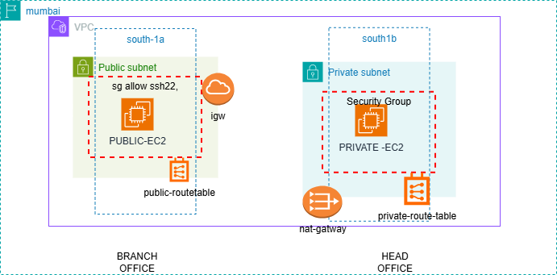

# secure-ec2-access-with-bastion-host-and-nat
Secure AWS VPC setup with a Bastion Host in the public subnet providing SSH access to a private EC2 instance. Includes public/private subnets, NAT Gateway for outbound internet, route tables, security groups, and complete network architecture following AWS best practices.”




# Secure EC2 Access with Bastion Host and NAT Gateway

This project demonstrates a secure AWS network architecture using a Bastion Host for SSH access to private EC2 instances.  
The setup follows AWS best practices and includes public/private subnets, NAT Gateway for outbound internet access, Internet Gateway, custom route tables, and strict security groups.

---

## 📌 Architecture Overview


---

## 🏗️ **Components Used**

### 🔹 VPC
- CIDR: **10.0.0.0/16**
- Custom VPC created for isolated networking

### 🔹 Subnets
| Subnet Type | Name | CIDR | Zone |
|-------------|------|-------|------|
| Public Subnet | pub-subnet | 10.0.0.0/24 | ap-south-1a |
| Private Subnet | private-subnet | 10.0.1.0/24 | ap-south-1b |

### 🔹 Internet Gateway (IGW)
- Attached to VPC for public subnet internet access

### 🔹 NAT Gateway
- Created in **public subnet**
- Provides internet access to **private EC2** only (outbound)

### 🔹 Route Tables
#### Public Route Table:
- Local route: 10.0.0.0/16 → local  
- IGW route: 0.0.0.0/0 → Internet Gateway

#### Private Route Table:
- Local route: 10.0.0.0/16 → local  
- NAT route: 0.0.0.0/0 → NAT Gateway

### 🔹 EC2 Instances
#### Public EC2 (Bastion Host)
- Subnet: 10.0.0.0/24  
- Private IP example: **10.0.0.x**  
- Used for SSH access to private EC2  
- Key pair copied here for jump access  

#### Private EC2
- Subnet: 10.0.1.0/24  
- Private IP: **10.0.1.192**  
- Accessible **only from public EC2** (bastion)

---

## 🔐 **Security Groups**

### Public EC2 SG:
- Inbound:  
  - SSH (22) → My IP
- Outbound: All allowed

### Private EC2 SG:
- Inbound:  
  - SSH (22) → Public EC2 SG only
- Outbound: All allowed (for NAT)

---

## 🧩 How Access Works (Flow)

1. **Laptop → Public EC2 (SSH allowed from your IP)**
2. **Public EC2 → Private EC2 (SSH allowed only from Bastion Host SG)**
3. **Private EC2 gets internet using NAT Gateway**

This isolates private instances from public exposure.

---

# 🖥️ Connect to Your EC2 Using PuTTY

**Instance Name:** public-ec2  
**Key File:** linuxkeypair.pem

---

## 1️⃣ Convert your `.pem` file to `.ppk` using PuTTYgen

1. Open **PuTTYgen**
2. Click **Load**
3. Change file type → **All Files (.)**
4. Select your key file:  
5. Click **Save private key**
6. Save the new file as:  
linuxkeypair.ppk

yaml
Copy code

---


---

## Upload Private Key to Public EC2 (Using FileZilla)

### 2. Open FileZilla

Go to:  
**File → Site Manager → New Site**

Set the following values:

- **Protocol:** SFTP – SSH File Transfer Protocol  
- **Host:**  
Example:

---


- **Port:** 22  
- **Logon Type:** Key file  
- **User:** ubuntu  
- **Key File:**


Click **Connect**

---

### 3. Upload `private-keypair.pem` to Public EC2

Upload this file to the EC2 directory:


Click **Connect**

---

✔ File uploaded successfully

---

### 4. Set Correct Permissions (VERY IMPORTANT)

Inside the Public EC2 terminal, run:

```bash
chmod 400 private-keypair.pem
🖥️ 5. SSH from Public EC2 → Private EC2

After uploading the key and fixing permissions, connect to your Private EC2 from inside your Public EC2.

🔹 Step 1: Confirm Key Inside Public EC2
ls


You must see:

linuxkeypair.pem

🔹 Step 2: Set Correct Permissions (VERY IMPORTANT)
chmod 400 linuxkeypair.pem


This avoids the error:

Permission denied (publickey)

🔹 Step 3: SSH into Private EC2 (using Private IP)

Replace with your private EC2 private IP (example below):

ssh -i linuxkeypair.pem ubuntu@10.0.1.192

🔹 Step 4: Successful Login

You should see:

Welcome to Ubuntu...
ubuntu@ip-10-0-1-192:~$


✔ You are now inside Private EC2 (via Public EC2 Bastion Host)


